# Adding the IST-Printer on a Linux Machine
Note: This was written for Ubuntu 18 and 20 with GUI. Your install may vary if using a different Linux or command line only.
YOU MUST BE INSIDE THE BUILDING ON AN ETHERNET CONNECTION OR ON THE VPN WHEN USING WIFI OR FROM OFF CAMPUS FOR THIS TO WORK

### Manual Install

1. You will want to stop auto printer installs so you don't have every printer from the network on your system. We will be running the following command in a terminal window.

`sudo systemctl disable --now avahi-daemon`

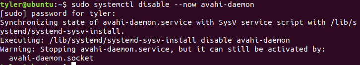

2. Next, we will need to download the printer driver, which can be found at this link:
https://github.com/UNO-IST-Support/ISTPrinter_for_Linux/raw/master/sharp-1.6-mx-c52-ps.tar.gz

or can use the command to download it to your home directory:
`wget https://github.com/UNO-IST-Support/ISTPrinter_for_Linux/raw/master/sharp-1.6-mx-c52-ps.tar.gz`

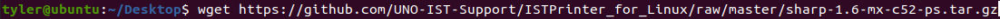

You will need to unpack this file by either using the archive software on your OS, or running the commands in Step 3 in a terminal. Please note that you will need to have the terminal window sitting in the same location as the file. To see if it is, type ls and you will get a list of files in that directory.

3. Once you find the file location, please run the following commands as sudo/root:   
`sudo apt install smbclient`
`sudo apt install cups`   

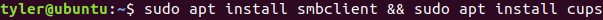

`tar -xvzf sharp-1.6-mx-c52-ps.tar.gz`

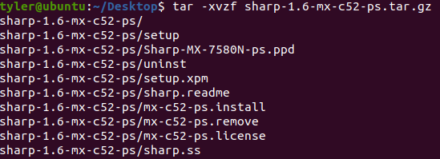

This next step may require you to cd into the extracted directory.
When the next thing pops up, make sure to install the Sharp-MX-7580-ps.ppd. Type yes and hit enter. Then do this again for the legal acceptance.

`sudo ./mx-c52-ps.install and choose Sharp-MX-7580-ps.ppd`

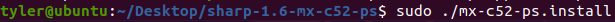

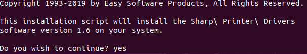

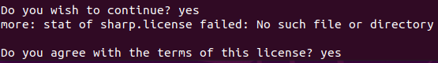

`/etc/init.d/cups restart`

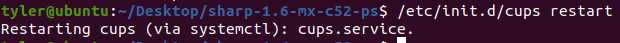

4. The next command listed will require more user input.

`system-config-printer`

You will need to click the dropdown for network printers, select add, and choose Windows Printer via SAMBA.
In the SMB Printer field, type `oist-printers.unomaha.edu/IST-Printer`
You will need to set authentification details.
In the user field, you will put your UNO NetID (example is if your NetID is jsmith, you will enter UNOMAHA\\jsmith)
In the password field, put your UNO NetID Password. You will need to click the `Set auth details now` button, then click forward

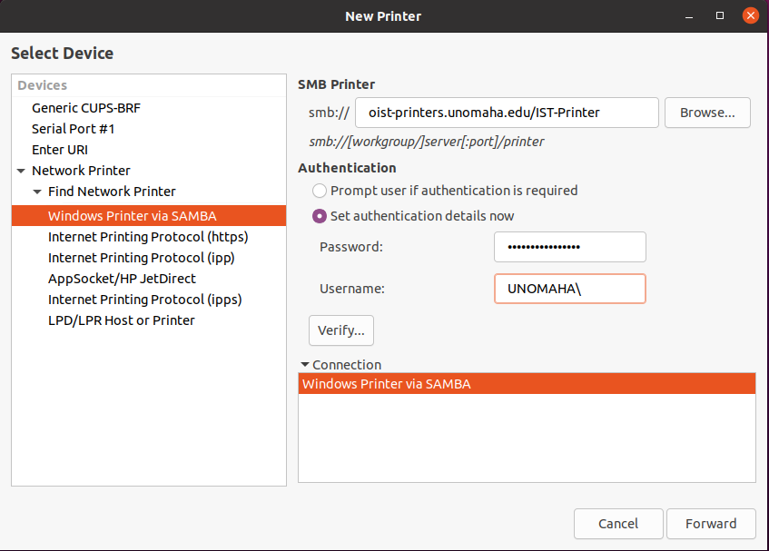

After that, you will choose `Provide .ppd file` and go to the directory with the extracted tar.gz. Select Sharp-MX-7580-ps.ppd and continue.

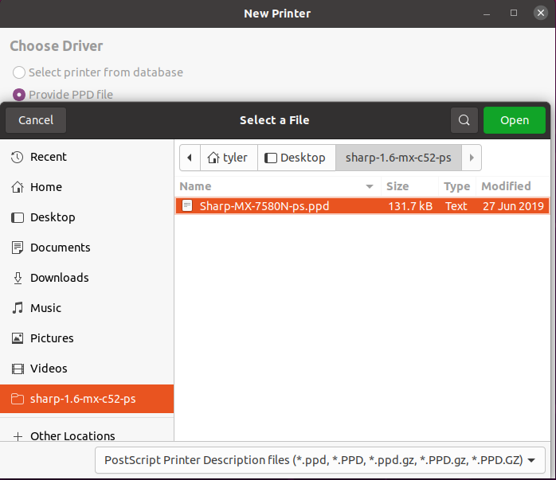

In the next window, There is a few dropdown boxes. Set the follow: `Input Tray Options: MX-LC13, Bypass: Installed, Output Tray Options: Finisher (Large Stacker), Punch Module: 3 Holes`. Leave all the boxes unchecked and hit Forward.

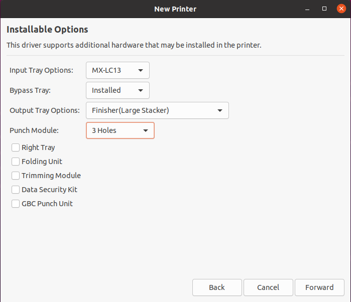

Change the printer names and description to 'IST-Printer' and click apply.

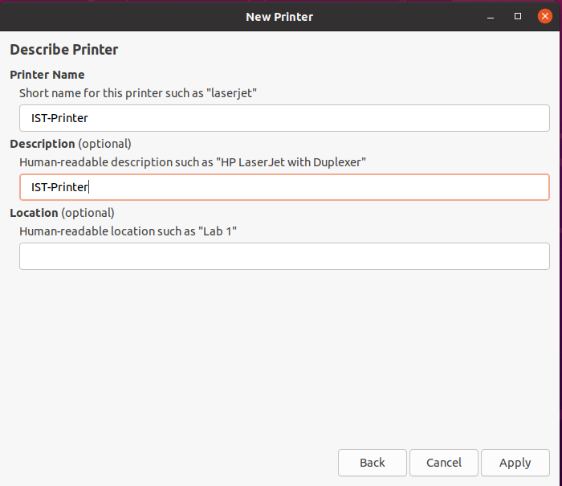

Once you run all of these and go through all the steps, you are free to remove the tar.gz and the extracted directory/zip. You should now be able to print a test page or whatever pages you need.
