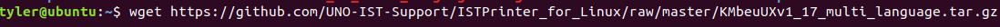
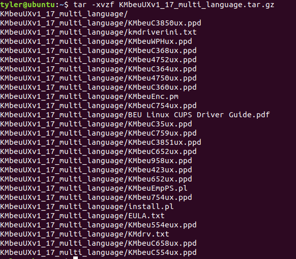
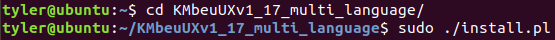
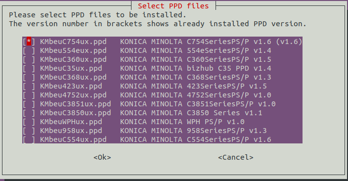
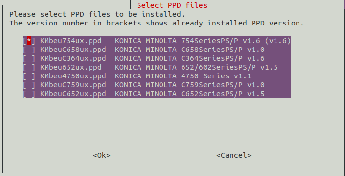
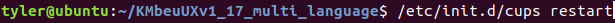
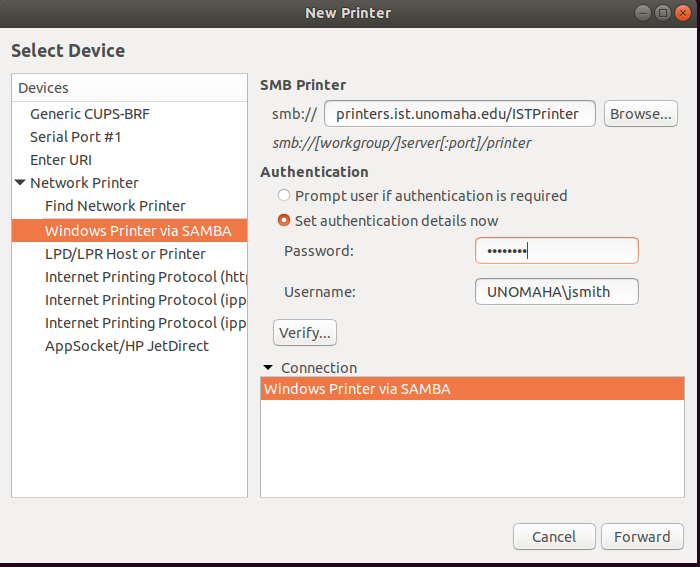
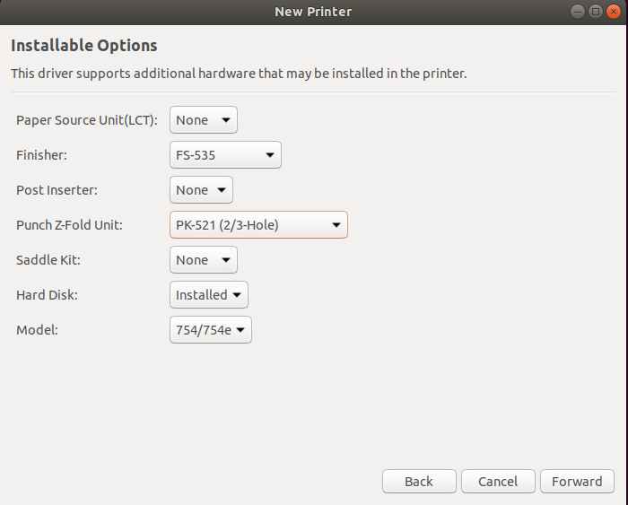
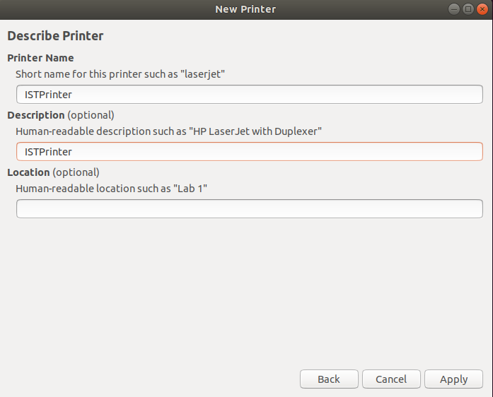

# Adding the ISTPrinter on a Linux Machine
Note: This was written for Ubuntu 18 with GUI. Your install may vary if using a different Linux or command line only.

### Option One - Script install
We wrote a script that will go through all the steps of installing the printer for you, but it will still require occasional input. You can get the script named "install-istprinter.sh" from here using terminal if you download the whole repository:

wget https://github.com/UNO-IST-Support/ISTPrinter_for_Linux/raw/master/install-istprinter.sh

Once you have downloaded that script, run the command in a terminal window that is in the same location as the downloaded script as root/sudo. This script still follows the manual install instructions, just makes it less typing for you.

sudo bash install.istprinter.sh

### Option Two - Manual Install

1. You will want to stop auto printer installs so you don't have every printer from the network on your system. We will be running the following command in a terminal window.

sudo systemctl disable --now avahi-daemon

2. Next, we will need to download the printer driver, which can be found at this link:
https://github.com/UNO-IST-Support/ISTPrinter_for_Linux/raw/master/KMbeuUXv1_17_multi_language.tar.gz

or can use the command to download it to your home directory:
wget https://github.com/UNO-IST-Support/ISTPrinter_for_Linux/raw/master/KMbeuUXv1_17_multi_language.tar.gz

You will need to unpack this file by either using the archive software on your OS, or running the following commands in a terminal. Please note that you will need to have the terminal window sitting in the same location as the file. To see if it is, type ls and you will get a list of files in that directory.

3. Once you find the file location, please run the following commands as sudo/root:
apt install smbclient
apt install cups

tar -xvzf KMbeuUXv1_17_multi_language.tar.gz

This next step may require you to cd into the extracted directory.
When the next thing pops up, make sure to install the KMbeuC754ux.ppd. Space will unselect, enter is continue.

./install.pl and choose KMbeuC754ux.ppd

/etc/init.d/cups restart

4. The next command listed will require more user input.

system-config-printer

You will need to click the dropdown for network printers, select add, and choose Windows Printer via SAMBA.
In the SMB Printer field, type 'printers.ist.unomaha.edu/ISTPrinter' without the quotes.
In the user field, you will put your UNO NetID (example is if your NetID is jsmith, you will enter UNOMAHA\\jsmith)
In the password field, put your UNO NetID Password. then click forward

After that, you will choose 'Provide .ppd file' and go to the directory with the extracted tar.gz. Select KMbeu754ux.ppd and continue.

In the next window, There is a few dropdown boxes. Find 'Finisher'. Change this to FS-535
Find the box labelled 'Punch Z-Fold' and change it to PK-521 (2/3 Hole) and click OK

Change the printer names and description to 'ISTPrinter' and click apply.

Once you run all of these and go through all the steps, you are free to remove the tar.gz and the extracted directory. You should now be able to print a test page or whatever pages you need.
